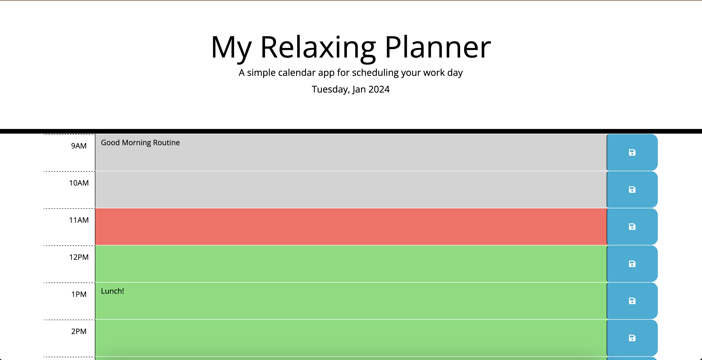

# my-relaxing-planner
jQuery relaxing planner using day.js lbrary to plan out each hour in the day and keep track of tasks to do.

## Description

A relaxing planner to plan out each hour in the day and keep track of tasks to do.

## Table of Contents

N/A

## Installation

N/A

## Usage

Users can write notes in each timeblock so they can plan out their day, they can then save the notes written in that day so when they leave the page the notes remain. Each time they use the planner a green block will highlight he times ahead whilst a red block highlights the current time and grey blocks mark the past time block.

I tested the function by changing the currentTime variable value in the timeBlocks function to 11AM, now I can see how the css style applies to the planner.

## Features

JavaScript

jQuery

HTML

CSS